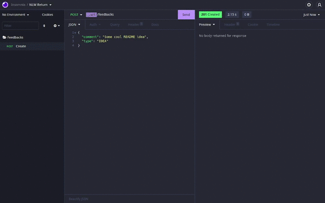

# Next Level Week - Feedget

This is the API of the main application of the Next Level Week bootcamp.

## 📄 Overview

The Feedget is a widget that collects feedbacks inside your application. The user can also take a screenshot of the page to send with the feedback.

You can see more in the [official website](https://nlw-return-i18n.vercel.app/)

### API



[See in video format](https://res.cloudinary.com/dpkgd6rhb/video/upload/v1652060110/github/nlw-return-api-overview_sc0ypz.mp4)

This API collect the feedbacks from the frontend, store them in the database and sends an email to the admin that a new feedback has been received with the feedback data

### CI/CD

The API contains the setup for [Github Actions](https://github.com/features/actions) run the tests (CI) and deploy to the cloud (CD)

The action config is in the following file: `.github/workflows/ci-cd.yml`

## 🏭 Technologies

### NestJS

NestJS is a progressive Node.js framework for building efficient, reliable and scalable server-side applications. (Source: NestJS)

[Official website](https://nestjs.com/)

### Prisma

Prisma is a next-generation Node.js and TypeScript ORM. (Source: Prisma)

[Official website](https://www.prisma.io/)

### Nodemailer

Nodemailer is a module for Node.js applications to allow easy as cake email sending. (Source: Nodemailer)

[Official Website](https://nodemailer.com)

## 🧪 Additional Tools

### Docker

Docker enables you to separate your applications from your infrastructure so you can deliver software quickly. (Source: Docker)

Used in this project for:

- Locally run the infra layer (Postgres) with [docker-compose](https://docs.docker.com/compose/) using fast commands and a simple configuration

[Official website](https://docker.com)

### ESLint

ESLint is a tool for identifying and reporting on patterns found in ECMAScript/JavaScript code. (Source: ESLint)

[Official website](https://github.com/eslint/eslint)

### Prettier

Prettier is a code formatter. (Source: Prettier)

[Official website](https://prettier.io)

### Jest

Jest is a delightful JavaScript Testing Framework with a focus on simplicity. (Source: Jest)

[Official website](https://jestjs.io/)

## 💻 Usage

You can run this API in you local machine by following the [Installation](#constructionworker-installation) guide.

## :construction_worker: Installation

### Tools

You go need these tools to install this repository on your local machine:

- Docker & Docker Compose. [Install guide](https://docs.docker.com/engine/install/)
- Git. [Install guide](https://github.com/git-guides/install-git)
- Yarn. [Install guide](https://classic.yarnpkg.com/lang/en/docs/install/#debian-stable)

After you install all these tools up head, you can proceed to the next topic.

### Cloning the Repository:

First of all, clone the repository by running the following command:

```bash
git clone https://github.com/Cauaspinheiro/nlw-return-api.git
```

After this, go to the project's folder by running the following command:

```bash
cd nlw-return-api
```

### Installing the project's dependencies

You can install the project's dependencies by running the following command inside the project's folder:

```bash
yarn
```

### `.env` - Environment variables

The dotenv file (.env) contains all the environment variables of the project. You can see the variable inside the `.env.example` file.

To configure the `.env`, you can create a new `.env` file and copy all the `.env.example` content inside this file. Then, complete the value of each key with you configuration.

#### Database URL

key: `DATABASE_URL`

The [postgres connection string](https://www.postgresql.org/docs/current/libpq-connect.html#LIBPQ-CONNSTRING) to the database

#### STMP server config

keys: `SMTP_USER` - `SMTP_PASSWORD` - `SMTP_PORT` - `SMTP_HOST`

The SMTP configuration to send emails. You have to setup this manually.

It's recommended using the [Mailtrap](https://mailtrap.io) to a development SMTP server, because it's free, easy to setup and very complete.

---

**That's it!** Now you can run the project on your local machine. See the [scripts](#scripts) section for all available scripts

## 🏃 Scripts

### build

```bash
yarn build
```

Build the project for production use.

### format

```bash
yarn format
```

Format the project code using prettier.

### start

```bash
yarn start
```

Start the project using [NestJS CLI](https://docs.nestjs.com/cli/overview).

### start:prod

```bash
yarn start:prod
```

Run the build artifact with plain NodeJS.

You have to run the `build` command before you run this command to work.

### dev

```bash
yarn dev
```

Start the project with hot-reloading using [NestJS CLI](https://docs.nestjs.com/cli/overview).

### debug

```bash
yarn debug
```

Start the project with debug tools using [NestJS CLI](https://docs.nestjs.com/cli/overview).

### lint

```bash
yarn lint
```

Lint the project code using ESLint.

### test

```bash
yarn test
```

Run the tests using Jest, you can see all the flags you can pass to this command [here](https://jestjs.io/docs/cli#reference).

## 🔗 Useful links

- Web: https://github.com/cauaspinheiro/nlw-return-web

---

Bootcamp made with ❤️ by [Rocketseat](https://rocketseat.com.br)
